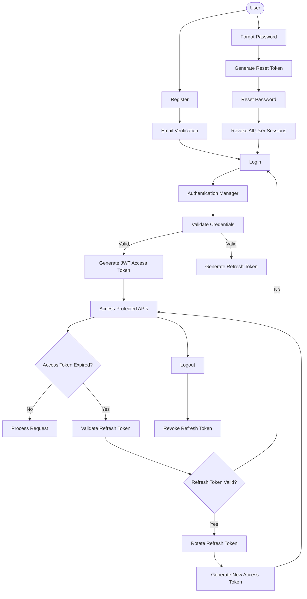
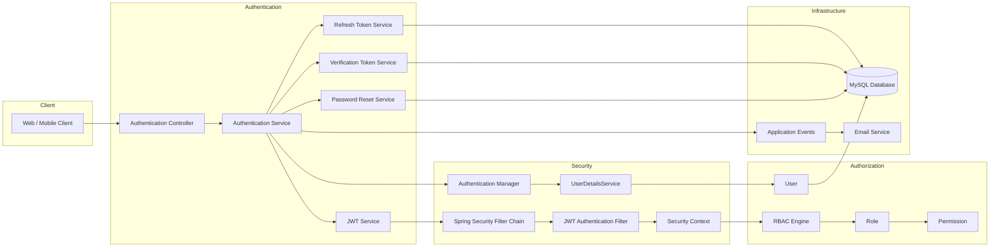

# AI-Powered Phishing Detection Platform

A production-oriented phishing detection platform built with **Java**, **Spring Boot**, and modern backend engineering practices.

This project started as a simple phishing detection application but is now being rebuilt from the ground up with a focus on **security, scalability, clean architecture, and real-world backend design**. The goal is not only to detect phishing attacks but also to understand how production SaaS applications are engineered.

> 🚧 The project is currently under active development and is being built in phases.

---

## Current Status

### ✅ Phase 1: Authentication & Authorization (Completed)

The first phase establishes a secure foundation for the platform by implementing a complete authentication lifecycle instead of basic JWT authentication.

### Authentication

- User Registration
- Secure Login
- JWT Access Tokens
- Refresh Tokens
- Refresh Token Rotation
- Logout
- Logout from All Devices

### Account Security

- Email Verification
- Forgot Password
- Reset Password
- Change Password

### Authorization

- Role-Based Access Control (RBAC)
- User → Role → Permission Architecture
- Permission-Based Authorization
- Spring Security Integration

---

## Production Techniques

During this phase, the focus was on implementing patterns commonly used in production applications.

- Spring Security 6
- Stateless JWT Authentication
- Database-backed Refresh Tokens
- Refresh Token Rotation
- Secure Password Hashing (BCrypt)
- Token Revocation Strategy
- Event-Driven Email Workflows
- Global Exception Handling
- Bean Validation
- Transaction Management
- DTO Mapping (MapStruct)
- Layered Architecture

---

# Authentication Module

## Authentication Flow




## Authentication Architecture



## Tech Stack

### Backend

- Java 21
- Spring Boot 3
- Spring Security
- Spring Data JPA
- Hibernate

### Database

- MySQL

### Authentication

- JWT
- Refresh Tokens
- BCrypt Password Hashing

### Utilities

- Maven
- Lombok
- MapStruct

---

## Project Structure

```
src
├── auth
├── config
├── security
├── user
├── role
├── permission
├── email
├── exception
├── common
└── util
```

---

## Roadmap

### ✅ Phase 1 — Authentication & Authorization

- Authentication
- Authorization
- Account Security
- Session Management

### 🚧 Phase 2 — Multi-Tenant Architecture

- Organization Management
- Individual & Organization Workspaces
- Tenant Isolation
- Team Invitations
- Organization Roles

### ⏳ Phase 3 — Detection Engine

- URL Analysis
- Redirect Analysis
- Domain Analysis
- Keyword Detection
- Risk Scoring Engine

### ⏳ Phase 4 — AI Intelligence

- Gemini Integration
- AI Threat Analysis
- Explainable AI
- Security Recommendations

### ⏳ Phase 5 — Enterprise Features

- Audit Logging
- Active Sessions
- Device Management
- Rate Limiting
- Brute Force Protection

### ⏳ Phase 6 — Deployment

- Docker
- CI/CD
- Monitoring
- Logging
- Production Deployment


---

## Why This Project?

This project is part of my journey to become a better backend engineer.

Instead of focusing only on implementing features, I'm using it to learn how production systems are designed—from authentication and authorization to multi-tenancy, security, and scalable backend architecture.

Every phase introduces new engineering challenges, and I'll continue improving the platform as I explore more advanced backend concepts.

---

## Contributing

Suggestions, feedback, and discussions are always welcome.

---

## License

This project is licensed under the MIT License.
